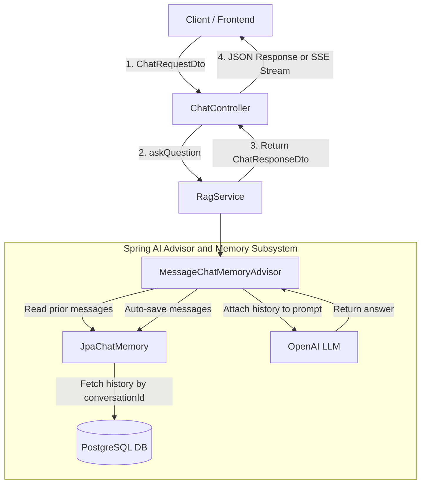
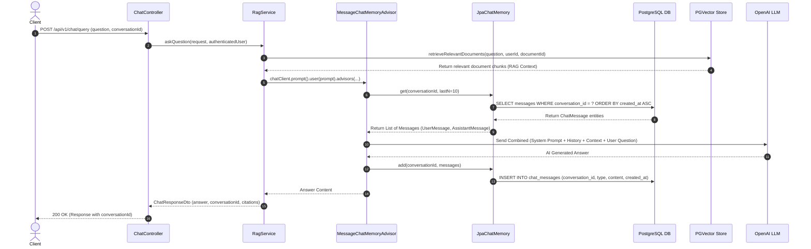
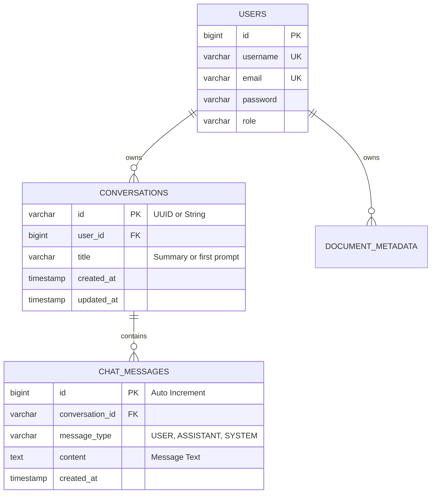
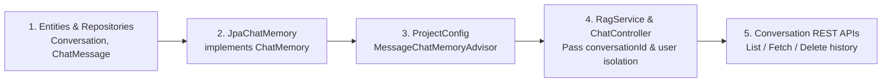

# DocMind — Database-Backed Chat Memory & Conversation History Architecture

This document provides an end-to-end design and step-by-step implementation guide for storing chat history and conversational memory in PostgreSQL corresponding to each `conversationId` in **DocMind**.

---

## 1. System Architecture and Component Interaction



---

## 2. Sequence Diagram: Chat Query & Memory Lifecycle



---

## 3. Database Schema Design

### 3.1 Entity-Relationship (ER) Diagram



### 3.2 SQL DDL Schema

```sql
-- Conversations Table
CREATE TABLE conversations (
    id VARCHAR(100) PRIMARY KEY,
    user_id BIGINT NOT NULL REFERENCES users(id) ON DELETE CASCADE,
    title VARCHAR(255) NOT NULL,
    created_at TIMESTAMP WITHOUT TIME ZONE NOT NULL DEFAULT NOW(),
    updated_at TIMESTAMP WITHOUT TIME ZONE NOT NULL DEFAULT NOW()
);

CREATE INDEX idx_conversations_user_id ON conversations(user_id);
CREATE INDEX idx_conversations_updated_at ON conversations(updated_at DESC);

-- Chat Messages Table
CREATE TABLE chat_messages (
    id BIGSERIAL PRIMARY KEY,
    conversation_id VARCHAR(100) NOT NULL REFERENCES conversations(id) ON DELETE CASCADE,
    message_type VARCHAR(50) NOT NULL,
    content TEXT NOT NULL,
    created_at TIMESTAMP WITHOUT TIME ZONE NOT NULL DEFAULT NOW()
);

CREATE INDEX idx_chat_messages_conversation_id ON chat_messages(conversation_id);
CREATE INDEX idx_chat_messages_created_at ON chat_messages(conversation_id, created_at ASC);
```

---

## 4. Step-by-Step Implementation Guide



---

### Step 1: Create Entities & Enums

#### 1.1 `MessageType.java`
```java
package com.substring.docmind.entity;

public enum MessageType {
    USER,
    ASSISTANT,
    SYSTEM
}
```

#### 1.2 `Conversation.java`

```java
package com.substring.docmind.entity;

import com.docmind.entity.ChatMessage;
import com.docmind.entity.User;
import jakarta.persistence.*;
import lombok.*;

import java.time.LocalDateTime;
import java.util.ArrayList;
import java.util.List;

@Entity
@Table(name = "conversations")
@Getter
@Setter
@NoArgsConstructor
@AllArgsConstructor
@Builder
public class Conversation {

    @Id
    private String id; // Conversation UUID

    @ManyToOne(fetch = FetchType.LAZY)
    @JoinColumn(name = "user_id", nullable = false)
    private User user;

    @Column(nullable = false)
    private String title;

    @Column(nullable = false, updatable = false)
    private LocalDateTime createdAt;

    @Column(nullable = false)
    private LocalDateTime updatedAt;

    @Builder.Default
    @OneToMany(mappedBy = "conversation", cascade = CascadeType.ALL, orphanRemoval = true)
    private List<ChatMessage> messages = new ArrayList<>();
}
```

#### 1.3 `ChatMessage.java`

```java
package com.substring.docmind.entity;

import com.docmind.entity.Conversation;
import com.docmind.entity.MessageType;
import jakarta.persistence.*;
import lombok.*;

import java.time.LocalDateTime;

@Entity
@Table(name = "chat_messages")
@Getter
@Setter
@NoArgsConstructor
@AllArgsConstructor
@Builder
public class ChatMessage {

    @Id
    @GeneratedValue(strategy = GenerationType.IDENTITY)
    private Long id;

    @ManyToOne(fetch = FetchType.LAZY)
    @JoinColumn(name = "conversation_id", nullable = false)
    private Conversation conversation;

    @Enumerated(EnumType.STRING)
    @Column(name = "message_type", nullable = false)
    private MessageType messageType;

    @Column(columnDefinition = "TEXT", nullable = false)
    private String content;

    @Column(nullable = false, updatable = false)
    private LocalDateTime createdAt;
}
```

---

### Step 2: Create JPA Repositories

#### 2.1 `ConversationRepository.java`

```java
package com.substring.docmind.repository;

import entity.com.docmind.Conversation;
import entity.com.docmind.User;
import org.springframework.data.jpa.repository.JpaRepository;

import java.util.List;
import java.util.Optional;

public interface ConversationRepository extends JpaRepository<Conversation, String> {
    List<Conversation> findByUserOrderByUpdatedAtDesc(User user);

    Optional<Conversation> findByIdAndUser(String id, User user);

    void deleteByIdAndUser(String id, User user);
}
```

#### 2.2 `ChatMessageRepository.java`

```java
package com.substring.docmind.repository;

import entity.com.docmind.ChatMessage;
import org.springframework.data.jpa.repository.JpaRepository;
import org.springframework.data.jpa.repository.Query;
import org.springframework.data.repository.query.Param;

import java.util.List;

public interface ChatMessageRepository extends JpaRepository<ChatMessage, Long> {
    List<ChatMessage> findByConversation_IdOrderByCreatedAtAsc(String conversationId);

    @Query(value = "SELECT * FROM chat_messages WHERE conversation_id = :conversationId ORDER BY created_at DESC LIMIT :lastN", nativeQuery = true)
    List<ChatMessage> findLastNMessages(@Param("conversationId") String conversationId, @Param("lastN") int lastN);

    void deleteByConversation_Id(String conversationId);
}
```

---

### Step 3: Implement `JpaChatMemory`

Implement Spring AI's `ChatMemory` interface to automatically translate between Spring AI `Message` objects (`UserMessage`, `AssistantMessage`, `SystemMessage`) and database `ChatMessage` records:

```java
package com.substring.docmind.service;

import entity.com.docmind.ChatMessage;
import entity.com.docmind.Conversation;
import entity.com.docmind.MessageType;
import repository.com.docmind.ChatMessageRepository;
import repository.com.docmind.ConversationRepository;
import lombok.RequiredArgsConstructor;
import lombok.extern.slf4j.Slf4j;
import org.springframework.ai.chat.memory.ChatMemory;
import org.springframework.ai.chat.messages.*;
import org.springframework.stereotype.Service;
import org.springframework.transaction.annotation.Transactional;

import java.time.LocalDateTime;
import java.util.*;

@Slf4j
@Service
@RequiredArgsConstructor
public class JpaChatMemory implements ChatMemory {

    private final ChatMessageRepository messageRepository;
    private final ConversationRepository conversationRepository;

    @Override
    @Transactional
    public void add(String conversationId, List<Message> messages) {
        if (messages == null || messages.isEmpty()) {
            return;
        }

        Conversation conversation = conversationRepository.findById(conversationId)
                .orElseGet(() -> {
                    log.warn("Conversation {} not found when adding messages. Creating placeholder.", conversationId);
                    return conversationRepository.save(
                            Conversation.builder()
                                    .id(conversationId)
                                    .title("New Conversation")
                                    .createdAt(LocalDateTime.now())
                                    .updatedAt(LocalDateTime.now())
                                    .build()
                    );
                });

        for (Message msg : messages) {
            MessageType type = switch (msg.getMessageType()) {
                case USER -> MessageType.USER;
                case ASSISTANT -> MessageType.ASSISTANT;
                case SYSTEM -> MessageType.SYSTEM;
                default -> MessageType.USER;
            };

            ChatMessage chatMessage = ChatMessage.builder()
                    .conversation(conversation)
                    .messageType(type)
                    .content(msg.getText())
                    .createdAt(LocalDateTime.now())
                    .build();

            messageRepository.save(chatMessage);
        }

        conversation.setUpdatedAt(LocalDateTime.now());
        conversationRepository.save(conversation);
    }

    @Override
    @Transactional(readOnly = true)
    public List<Message> get(String conversationId, int lastN) {
        List<ChatMessage> dbMessages = messageRepository.findLastNMessages(conversationId, lastN);
        if (dbMessages == null || dbMessages.isEmpty()) {
            return Collections.emptyList();
        }

        // Reverse to maintain chronological order
        Collections.reverse(dbMessages);

        List<Message> springAiMessages = new ArrayList<>();
        for (ChatMessage msg : dbMessages) {
            switch (msg.getMessageType()) {
                case USER -> springAiMessages.add(new UserMessage(msg.getContent()));
                case ASSISTANT -> springAiMessages.add(new AssistantMessage(msg.getContent()));
                case SYSTEM -> springAiMessages.add(new SystemMessage(msg.getContent()));
            }
        }
        return springAiMessages;
    }

    @Override
    @Transactional
    public void clear(String conversationId) {
        messageRepository.deleteByConversation_Id(conversationId);
    }
}
```

---

### Step 4: Configure `ChatClient` with `MessageChatMemoryAdvisor`

In `ProjectConfig.java`:

```java
package com.substring.docmind.config;

import org.springframework.ai.chat.client.ChatClient;
import org.springframework.ai.chat.client.advisor.MessageChatMemoryAdvisor;
import org.springframework.ai.chat.memory.ChatMemory;
import org.springframework.context.annotation.Bean;
import org.springframework.context.annotation.Configuration;

@Configuration
public class ProjectConfig {

    @Bean
    public ChatClient chatClient(ChatClient.Builder builder, ChatMemory chatMemory) {
        return builder
                .defaultSystem("""
                    You are DocMind, an intelligent, versatile, and friendly AI document intelligence assistant.                        
                    Your Capabilities:
                    1. Document-Grounded Q&A: When context from the user's uploaded documents is provided, prioritize and base your answer directly on that context, citing document names and page numbers when available.
                    2. General Knowledge & Conversation: If the user engages in general conversation, answer helpfully, accurately, and naturally.
                    3. Hybrid Synthesis: If the document context partially covers a topic, synthesize the document facts with your broader knowledge.
                    4. Tone & Format: Always be warm, professional, clear, and structured with Markdown.
                """)
                .defaultAdvisors(
                    MessageChatMemoryAdvisor.builder(chatMemory)
                            .build()
                )
                .build();
    }
}
```

---

### Step 5: Update `RagService` & User Conversation Lifecycle

In `RagService.java`:

```java
import static org.springframework.ai.chat.client.advisor.AbstractChatMemoryAdvisor.CHAT_MEMORY_CONVERSATION_ID_KEY;
import static org.springframework.ai.chat.client.advisor.AbstractChatMemoryAdvisor.CHAT_MEMORY_RETRIEVE_SIZE_KEY;

@Service
@RequiredArgsConstructor
public class RagService {

    private final VectorStore vectorStore;
    private final AppProperties appProperties;
    private final ChatClient chatClient;
    private final ConversationRepository conversationRepository;

    public ChatResponseDto askQuestion(ChatRequestDto request, User user) {
        long startTime = System.currentTimeMillis();

        String conversationId = (request.getConversationId() != null && !request.getConversationId().isBlank())
                ? request.getConversationId()
                : UUID.randomUUID().toString();

        // 1. Ensure Conversation exists for the authenticated user
        ensureConversationExists(conversationId, user, request.getQuestion());

        // 2. Retrieve document chunks isolated by userId
        List<Document> similarDocuments = this.retrieveRelevantDocuments(
                request.getQuestion(),
                request.getDocumentId(),
                request.getTopK(),
                request.getMinSimilarity(),
                user
        );

        List<CitationDto> citationDtos = similarDocuments.stream().map(this::mapToCitation).toList();
        String contextText = buildContextString(similarDocuments);
        String prompt = buildPrompt(request.getQuestion(), contextText);

        // 3. Prompt ChatClient with Conversation Memory Advisors
        String answer = this.chatClient.prompt()
                .user(prompt)
                .advisors(a -> a
                        .param(CHAT_MEMORY_CONVERSATION_ID_KEY, conversationId)
                        .param(CHAT_MEMORY_RETRIEVE_SIZE_KEY, 10))
                .call()
                .content();

        long responseTime = System.currentTimeMillis() - startTime;

        return ChatResponseDto.builder()
                .answer(answer)
                .conversationId(conversationId)
                .citations(citationDtos)
                .responseTimeMs(responseTime)
                .build();
    }

    private void ensureConversationExists(String conversationId, User user, String question) {
        conversationRepository.findByIdAndUser(conversationId, user)
                .orElseGet(() -> {
                    String title = question.length() > 50 ? question.substring(0, 47) + "..." : question;
                    return conversationRepository.save(
                            Conversation.builder()
                                    .id(conversationId)
                                    .user(user)
                                    .title(title)
                                    .createdAt(LocalDateTime.now())
                                    .updatedAt(LocalDateTime.now())
                                    .build()
                    );
                });
    }
}
```

---

### Step 6: REST APIs for Conversation History

Expose endpoints in `ChatController.java` to support sidebar conversation threads in the UI:

| HTTP Method | Endpoint | Description |
| :--- | :--- | :--- |
| `GET` | `/api/v1/chat/conversations` | List all conversation threads of the logged-in user |
| `GET` | `/api/v1/chat/conversations/{id}/messages` | Get all messages inside a specific conversation |
| `DELETE` | `/api/v1/chat/conversations/{id}` | Delete a conversation and purge its message history |

---

## 5. Summary & Key Benefits

1. **Persistent Across Restarts**: Stored safely in PostgreSQL relational tables.
2. **Multi-Tenant User Isolation**: Every conversation belongs to a `user_id`. Users cannot inspect or inject messages into other users' conversations.
3. **Seamless Spring AI Integration**: Uses native `MessageChatMemoryAdvisor`, keeping controller/service code clean and modular.
4. **Optimized Performance**: Uses composite index `(conversation_id, created_at)` with `LIMIT lastN` to ensure minimal DB latency.
