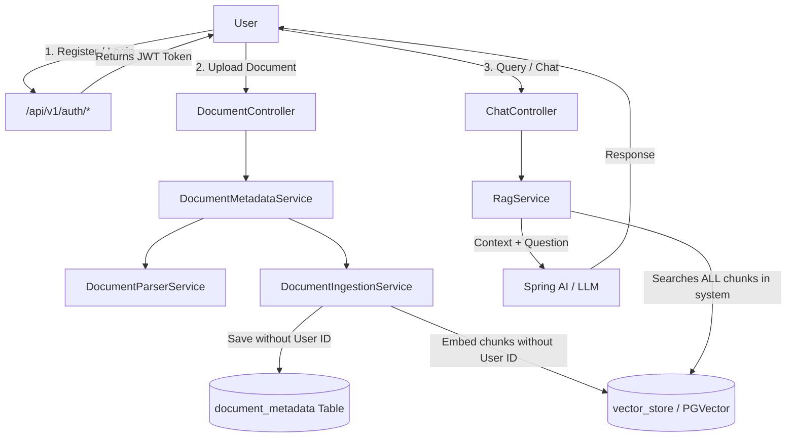
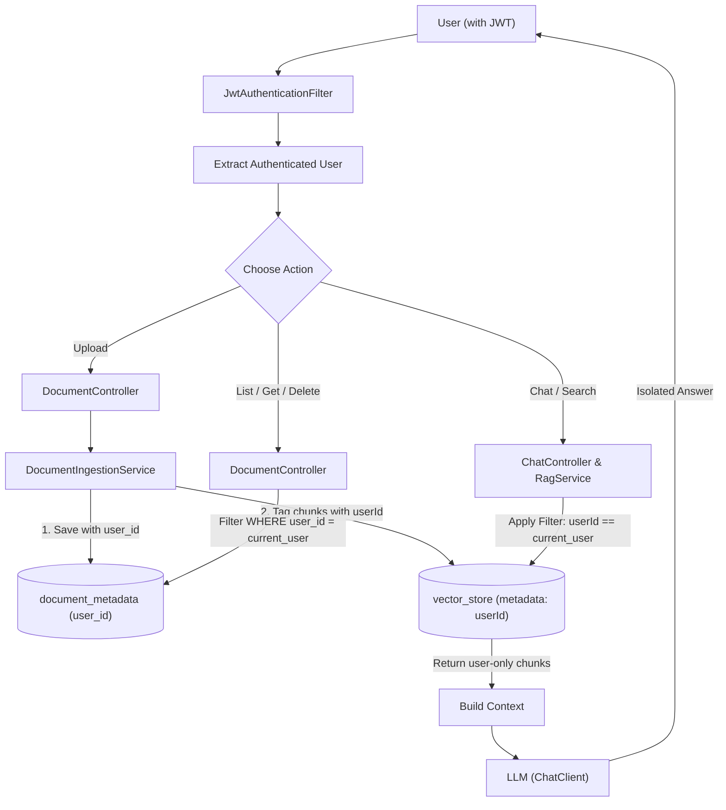
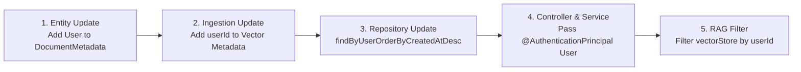

# DocMind Backend Analysis & User Document Isolation Architecture

This document breaks down the current state of the DocMind backend, explains existing workflows, and details step-by-step changes required to ensure each user can only access and chat with their own documents.

---

## 1. Existing System Architecture & Flows

### 1.1 Existing Flow Diagram



---

### 1.2 Current State Breakdown

| Component | Current Implementation | Limitation / Gap |
| :--- | :--- | :--- |
| **Authentication** | JWT Auth is configured (`/api/v1/auth/**`), and endpoints under `/api/v1/**` are protected by `SecurityFilterChain`. | `Authentication` context exists, but user information is not passed to business services. |
| **Document Metadata (`document_metadata`)** | Contains `id`, `filename`, `contentType`, `fileSize`, `status`, `totalPages`, `totalChunks`, `createdAt`. | **No foreign key / association with `User`**. Any user listing documents gets all documents in the database. |
| **Vector Store (`vector_store` table)** | Chunks are stored with metadata `documentId`, `fileName`, `contentType`, `chunkIndex`, `pageNumber`. | **No `userId` metadata** is attached to chunks. |
| **Chat / RAG Query (`RagService`)** | Searches PGVector globally or scoped only by `documentId` if passed. | When chatting across documents, a user receives context chunks from **all users' uploaded files**. |

---

## 2. Target Flow: Multi-Tenant User Isolation

In the proposed flow, each user's data is isolated both at the relational database level and the vector database level.

### 2.1 Target Isolated Flow Diagram



---

## 3. Implementation Roadmap



---

## 4. What to Add / Modify (Step-by-Step Code Guide)

### Step 1: Update `DocumentMetadata` Entity
Add a `@ManyToOne` relationship to link each document to the owning user.

```java
// File: src/main/java/com/substring/docmind/entity/DocumentMetadata.java

@ManyToOne(fetch = FetchType.LAZY)
@JoinColumn(name = "user_id", nullable = false)
private User user;
```

---

### Step 2: Update `DocumentMetadataRepo`
Add repository query methods scoped by user:

```java
// File: src/main/java/com/substring/docmind/repository/DocumentMetadataRepo.java

List<DocumentMetadata> findByUserOrderByCreatedAtDesc(User user);
Optional<DocumentMetadata> findByIdAndUser(UUID id, User user);
```

---

### Step 3: Enhance `CustomUserDetail`
Ensure the authenticated user object or user ID is easily accessible from `Authentication`:

```java
// File: src/main/java/com/substring/docmind/service/CustomUserDetail.java

public User getUser() {
    return this.user;
}

public Long getUserId() {
    return this.user.getId();
}
```

---

### Step 4: Include `userId` in Vector Store Metadata
In `DocumentIngestionService`, when creating chunks for `VectorStore`, tag each chunk with `userId`:

```java
// File: src/main/java/com/substring/docmind/service/DocumentIngestionService.java

enrichedMetadata.put("userId", metadata.getUser().getId().toString());
enrichedMetadata.put("documentId", metadata.getId().toString());
enrichedMetadata.put("fileName", metadata.getFilename());
```

---

### Step 5: Update Document Controller & Service
Pass the authenticated `User` from the controller into `DocumentMetadataService`:

```java
// In DocumentController:
@PostMapping(value = "/upload", consumes = MediaType.MULTIPART_FORM_DATA_VALUE)
public ResponseEntity<ApiResponse<DocumentResponseDto>> uploadDocument(
        @RequestParam("file") MultipartFile file,
        @AuthenticationPrincipal CustomUserDetail userDetail
) {
    DocumentResponseDto dto = documentService.uploadAndProcess(file, userDetail.getUser());
    return ResponseEntity.status(HttpStatus.CREATED).body(
        ApiResponse.<DocumentResponseDto>builder()
            .success(true)
            .data(dto)
            .timestamp(LocalDateTime.now())
            .message("Documents uploaded and indexed successfully")
            .build()
    );
}
```

Ensure `getAllDocuments(User user)`, `getDocumentById(UUID id, User user)`, and `deleteDocument(UUID id, User user)` enforce ownership check.

---

### Step 6: Enforce `userId` Filter in `RagService`
Update `RagService.retrieveRelevantDocuments` to always apply `userId` filtering:

```java
// File: src/main/java/com/substring/docmind/service/RagService.java

FilterExpressionBuilder b = new FilterExpressionBuilder();
Filter.Expression filter;

if (documentId != null) {
    // User wants to chat with a specific document
    filter = b.and(
        b.eq("userId", currentUserId.toString()),
        b.eq("documentId", documentId.toString())
    ).build();
} else {
    // User wants to chat across all their own documents
    filter = b.eq("userId", currentUserId.toString()).build();
}

searchRequestBuilder.filterExpression(filter);
```

---

## 5. Summary of Key Benefits

1. **Complete Data Privacy**: Users can never view, download, or delete other users' documents.
2. **Safe Multi-Tenant RAG**: Vector searches strictly filter chunks where `metadata.userId == currentUserId`, eliminating cross-user data leakage.
3. **Flexible Query Scopes**: Users can switch seamlessly between chatting with a single document (`documentId + userId`) or all their uploaded documents (`userId` only).
